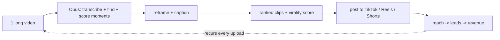

# Worked example — `opportunity-teardown` on **Opus Clip** (AI content tool, Lane A)

> **The first end-to-end proof of the engine.** Profile #1 (product/offer), first-run slice = AI content tools, mode =
> `full`. Lane A manual-add: the operator dropped "tear down Opus Clip." This file runs the whole pipeline — quick pass
> → operator gate → deep dive (§6.1/6.2/6.3/6.4) → level-up (§7) → score (§8) → routing description (§9/§10).
>
> **Facts are dated June 2026 and tagged for confidence.** Evidence tags: `verifiable` (multiple independent current
> sources) / `partially-verifiable` (sources conflict or single-source) / `unverifiable` / `likely-fake`. Sources are
> listed at the bottom.

---

## Step 0–1 — Profile + intake

- **Profile:** product/offer (config from `references/profiles.md`). No safety gate (a product, not code/accounts).
- **Lane:** A — operator manual-add. **Source:** opus.pro. **Date:** 2026-06-16.
- **Ingest:** would normally call `vis-extraction` on the product page + a review/comparison article; here the read was
  done via web search (facts + sources below).

---

## Step 2 — QUICK PASS (beefy preview) — per `quick-pass-contract.md`

### Quick Pass — Opus Clip
**Profile:** product/offer · **Mode:** quick-pass · **Date:** 2026-06-16

- **What it is:** An AI tool that takes one long video (a podcast, webinar, YouTube upload) and automatically cuts it
  into many short, captioned, vertical clips ready to post to TikTok / Reels / Shorts — sold to creators and marketing
  teams. `verifiable`
- **The value & the interest:** The clever core isn't "it makes clips" — it's the **virality score** that ranks which
  moments are worth posting, plus reframing that keeps the speaker centered. It turns a multi-hour manual editing chore
  into a one-upload, minutes-later batch of post-ready assets. `verifiable`
- **Why it's a good idea:** Every creator and B2B brand now has to feed several short-form feeds *every week*, and
  editing shorts by hand is slow and hated. Opus removes the slowest, most repetitive step. `verifiable`
- **How it makes money:** SaaS subscription, metered by **source-video processing minutes** per month — Free (60
  min, watermarked, expire in 3 days), Starter $15/mo (150 min), Pro $29/mo (300 min, 1080p, multi-platform
  auto-posting), Business (custom). `verifiable`
- **Fresh / growing read:** **Recency** — still shipping fast (launched "Agent Opus," an end-to-end short-form AI
  agent, Aug 2025). **Velocity** — high: ~10M+ users by early 2025 (from 5M in the first 7 months), ~70M videos made
  in 18 months; ~$10–20M revenue/ARR; $215M valuation (Mar 2025, SoftBank Vision Fund 2). **Saturation penalty** —
  steep: this is a crowded, well-funded category. Net: very fresh + fast-growing, but **late and crowded for a
  newcomer.** `partially-verifiable` (user/revenue/valuation figures conflict across trackers)
- **How crowded:** Heavily. Direct, well-known competitors include **Vizard, Klap, Submagic, Descript, Choppity,
  Vugola** — at least 6 credible direct alternatives, most priced $19–29/mo, several with their own funding. Early?
  No — this category matured 2023→2026. `verifiable`
- **Provenance:** Lane A (operator manual-add) · opus.pro · 2026-06-16.

**Gate recommendation:** **pursue** — not as a rebuild target (the category is crowded and the incumbent is
$50M-funded), but because the *capability* maps directly onto Oliver's Keelworks YouTube growth venture and a
client-facing short-form service. Worth a deep dive on the money/use angle. (Operator decides.)

---

## Step 3 — OPERATOR GATE

> Quick pass presented; operator flags **pursue** (continuing in `full` mode). Deep dive runs on this one keeper.

---

## Step 4 — DEEP DIVE (full report) — per `deep-dive-contract.md`

### §6.1 The teardown

- **Angle / positioning:** "Turn long videos into viral shorts, 10× faster." Positioned as the **default repurposing
  engine** for creators and social teams — breadth + a virality promise. `verifiable`
- **Creative & marketing hooks:** (1) the **virality score** — a number that promises to tell you which clip will pop,
  which is catnip for creators chasing the algorithm; (2) **"one upload → 10 clips"** volume framing; (3) a **generous
  free tier** (60 min/mo) as a frictionless on-ramp; (4) **auto-posting** that closes the loop from edit to publish.
  `verifiable`
- **The problem & who has it — what the pain looks like in real life:** A consultant records a 70-minute webinar. To
  feed her LinkedIn + TikTok + Shorts for the week she needs ~8 short clips. By hand that's an evening in a video
  editor: scrubbing for good moments, cropping to vertical, captioning, re-checking. She either burns 3–4 hours or
  skips short-form entirely and loses reach. The pain is **recurring, time-shaped, and tied to income** (reach →
  leads). Opus turns the evening into a 10-minute upload-and-pick. `verifiable`
- **How it's actually used (walk-through):** (1) paste a YouTube URL or upload a file; (2) pick aspect ratio + a
  caption style + a topic/keyword filter; (3) Opus transcribes, finds candidate moments, scores them, reframes to
  vertical, burns captions; (4) you get a ranked list of clips with virality scores; (5) tweak captions/trim; (6)
  download or auto-post to platforms. `verifiable`
- **Rare-and-valuable core:** Not the clipping (commoditized) — it's the **moment-selection + virality ranking model
  trained on a huge corpus** (~70M videos processed), plus the brand/distribution flywheel of being the category's
  default name. The data advantage is the real moat. `partially-verifiable` (corpus size is maker-adjacent reporting)
- **How they likely build it:** ASR (speech-to-text) → an LLM/heuristics layer for moment segmentation + a ranking
  model for "virality" → face/subject tracking for reframing → caption rendering → platform-posting integrations,
  wrapped in a metered SaaS. The 2025 "Agent Opus" adds an agent loop that sources b-roll and assembles end-to-end.
  `partially-verifiable` (architecture inferred, not disclosed)
- **Replication requirements (for us):** ASR (cheap, off-the-shelf), an LLM for segmentation (doable), a
  *trained* virality ranker (hard — needs labeled engagement data we don't have), subject-tracking reframe (moderate),
  caption render (easy), posting integrations (moderate, per-platform API pain). The ranker is the wall. `verifiable`
- **Value → money mechanism:** Time saved per video → willingness to pay a monthly fee; metered by processing minutes
  so heavy users (agencies, prolific creators) pay more. Low marginal cost per clip once the model exists → healthy
  SaaS margins. `verifiable`
- **The one key money-making insight:** **It sells a painful, recurring, high-volume chore as a cheap monthly
  subscription to a huge and growing population that must publish short-form every week — so value recurs on every
  upload, usage scales with the customer's content cadence, and churn stays low.** `verifiable`
- **Why buyers are pulled in:** Saves **time** (hours per video), saves **energy** (kills a hated chore), reduces
  **risk** (virality score lowers the "will this flop?" anxiety), and buys **status/reach** (more posts → more
  audience). `verifiable`
- **Moat & gaps:** *Moat* — data/brand/flywheel. *Gaps a better version exploits:* (1) it's **horizontal** — generic
  output, no industry voice; (2) **creator-shaped, not done-for-you** — a busy local-business owner still has to drive
  it; (3) virality scoring is tuned for entertainment/creator content, **not B2B/local-service** content; (4)
  metered-minutes pricing punishes long-form-heavy users. `partially-verifiable`
- **Build-for-myself-first fit:** **Partial.** Oliver wants the *capability* (short-form repurposing) for the Keelworks
  YouTube growth venture and for clients — but he does **not** want to own/rebuild a horizontal clip tool. The fit is
  "use the capability," not "build the product." `verifiable` (maps to `project_keelworks_growth_ventures`)
- **Effort-to-clone:** **L** to rebuild a competitive horizontal tool (the ranker + the brand are years and dollars
  away). **S–M** to build a *verticalized service* on top of an existing engine (see level-up). `verifiable`

### §6.2 Build-vs-buy-vs-use-as-is decision

- **Worth paying for a month to try hands-on?** **Yes — Pro at $29/mo for one month.** It teaches the production
  ceiling (how good the auto-clips really are on B2B/local content), exposes the gaps a service play would fill, and
  immediately powers real content for the Keelworks channel. The engine recommends; **Oliver makes the purchase.**
  `verifiable` (price current June 2026)
- **The three-way call:**
  - **Rebuild ourselves?** **No.** Honest math: a credible clone is an L build (call it 150–250+ focused hours just to
    a weak v1, and the virality ranker likely never matches a 70M-video corpus) versus a $29–$348/yr subscription to a
    far better incumbent. Rebuilding to compete head-on in a crowded, $50M-funded category is exactly the
    over-build-the-factory trap. `verifiable`
  - **Use it as-is to make money faster?** **YES — this is the recommended call.** Use Opus (or a competitor) as the
    *production engine* behind two money plays: (a) feed the Keelworks YouTube/short-form growth venture, and (b) sell
    **done-for-you short-form repurposing** as a Keelworks service to local-business clients. Don't rebuild the tool;
    **use it and earn.** (CLAUDE.md Core Principle: when in doubt, ship.)
  - **Skip?** No — the capability is too aligned with active ventures to ignore.
- **Recommended call:** **USE AS-IS (as a service engine).** **Runner-up:** a thin *verticalized service layer* on top
  (the level-up, §7) once the as-is service has paying clients — not a tool rebuild.

### §6.3 Money / go-to-market layer

- **Sectors & pains worth real money:** Local service businesses (electricians, contractors — EV, S&H), coaches/
  consultants, and B2B SaaS marketers all have the same pain: they have long assets (testimonials, job-site footage,
  webinars) and no time to cut them into a weekly short-form calendar. The pain there is **reach → leads → revenue**,
  which is worth real money. `verifiable` (clients per `project_clients_both_electrical`)
- **Where to plug it in:** (a) Keelworks' own YouTube/short-form channel (the growth venture); (b) a repurposing add-on
  bolted onto the existing client SEO + GBP-posting work — turn a client's existing footage into weekly Shorts +
  GBP video posts. `verifiable`
- **Who to pitch + price + honest ROI math:** Pitch existing SEO clients first (EV, S&H). **Price:** ~$300–$600/mo for
  a done-for-you "8 shorts + scheduling" retainer. **Their math:** 8 shorts/mo by hand ≈ 6–10 hours of skilled editing
  (≈ $300–$600 at $50/hr loaded) *that they never actually do*; the real benefit is the incremental reach/leads they'd
  otherwise miss. **Our cost:** one $29 Opus seat + ~1–2 hours of operator/agent time per client per month → the
  retainer is defensible and high-margin. `partially-verifiable` (rates are reasonable estimates, not quoted)
- **Becomes a Keelworks service:** "Short-Form Repurposing" joins the menu beside SEO + GBP — same clients, new
  recurring line item, shared footage pipeline. `verifiable`
- **Short vs. long term:** *Short:* sell the as-is retainer to 1–2 existing clients this quarter (fast cash, near-zero
  build). *Long:* build the verticalized service layer (§7) once 3+ clients prove demand. `verifiable`
- **Crawl → walk → run:** **Crawl** — buy one Pro seat, repurpose Oliver's/Keelworks' own content + one client's
  footage manually, prove the output quality. **Walk** — package it as a $300–$600/mo retainer, sign 2–3 clients,
  standardize the workflow. **Run** — wrap the workflow in the verticalized service layer (auto-pull client footage →
  Opus → brand-styled captions → GBP + platform posting on the client's cadence), the buildable level-up. `verifiable`

### §6.4 Visuals (keeper → inline preview; flag host-side for vault asset)

Inline preview of how Opus converts effort → money (Mermaid; render host-side if this becomes a committed vault asset
per `reference_cowork_chrome_screenshots_not_vault_reachable`):



> **Host-side flag:** if a committed `.png`/`.svg` diagram is wanted in the vault, generate it host-side — the Cowork
> sandbox can't land image assets in the vault.

---

## Step 5 — LEVEL-UP (superior version) — per `level-up-frameworks.md`

Framework checklist walked; the three best concepts (ranked). The crowding check is run on each because the horizontal
category is saturated.

#### Superior concept 1 — "Shorts-on-autopilot for local service businesses" · rank 1 of 3
- **Creative leap (verticalize + done-for-you):** Stop selling a *tool* to creators; sell an *outcome* to local
  service businesses. Opus is horizontal and creator-shaped; a vertical, done-for-you layer for electricians/
  contractors/home-services is a different, less-crowded buyer who pays for the result, not the software.
- **What to build:** a thin pipeline — intake client footage → run it through Opus (the engine) → apply a
  brand-consistent caption/templating pass → schedule to the client's platforms **and** their Google Business Profile
  on the existing posting cadence. Reuses Keelworks' GBP-posting infra and content systems.
- **Strategic build plan:** Phase 1 (crawl) manual, one client; Phase 2 (walk) standardized retainer, 2–3 clients;
  Phase 3 (run) wire the auto-pull + auto-post pipeline.
- **Buildability gate:** **BUILDABLE (effort: S→M).** Oliver already has the clients (EV, S&H), the GBP-posting
  automation, and the content systems; the missing piece is a templating/scheduling glue layer, not an AI model. The
  AI is rented from Opus.
- **Crowding on this version:** Lightly contested for *local-service vertical, GBP-integrated, done-for-you* — generic
  "social media management" agencies exist, but few combine local-SEO + GBP video posting + AI repurposing as one
  offer. Not confirmed empty (≥2 sources would be needed for a hard "empty" claim per §4); treat as **niche, not
  proven-empty.** `partially-verifiable`

#### Superior concept 2 — "B2B/local virality ranker" (unbundle the scoring) · rank 2 of 3
- **Creative leap (unbundle + reframe the model):** Opus's virality score is tuned for entertainment/creator content.
  Unbundle just the *ranking* and retune it for **B2B/local-service** content (what makes a contractor testimonial or
  a job-site clip convert, which is leads, not views).
- **What to build:** a labeled dataset of B2B/local clips vs. lead outcomes + a ranking model. **This is the wall:** we
  don't have the engagement/lead-outcome data at scale.
- **Buildability gate:** **SPECULATIVE** — requires proprietary labeled lead-outcome data Oliver doesn't have. Idea,
  not a candidate. Park.
- **Crowding:** N/A (gated out before crowding matters).

#### Superior concept 3 — "Footage-to-calendar agent tied to GBP cadence" (AI-native + make-the-boring-disappear) · rank 3 of 3
- **Creative leap:** Make the *whole* weekly content chore vanish for a local business: an agent that watches a shared
  folder of client footage, auto-generates a month of shorts + GBP video posts, and schedules them — owner approves
  from their phone.
- **What to build:** an agent loop composing Opus (clips) + the existing GBP-posting tool + a lightweight approval UI.
- **Buildability gate:** **BUILDABLE (effort: M).** Composes existing pieces (Opus as the engine + the existing
  GBP-posting tool + a lightweight approval UI); the approval UI + reliable scheduling is the real work, but Oliver has
  the stack to ship it. **Sequencing dependency (not a hedge on the verdict):** ship only after concept 1 proves
  demand — it's the Phase-3 evolution of concept 1, not an independent bet.
- **Crowding:** Agent Opus (Opus's own 2025 agent) is encroaching on the generic version; our edge is the **GBP/local
  integration**, which Opus doesn't do. `partially-verifiable`

**Level-up verdict:** Concept 1 is the real, buildable money play; concept 3 is its Phase-3 evolution; concept 2 is
speculative and parked. None of the buildable concepts is a tool-rebuild — consistent with the §6.2 "use as-is" call.

---

## Step 6 — SCORE (§8, via `prioritization` + `_meta/scoring-rubric.md`)

- **tier:** 2 (save for soon — adjacent to active ventures; concrete actions within a month)
- **relevance:** 4 (strongly related — Keelworks YouTube growth venture + client services)
- **actionability:** 3 (a real first step exists — buy a seat, repurpose one client's footage — but it needs
  packaging)
- **monetization:** **high** (recurring client retainer + own-channel growth)
- **build-for-myself-first fit:** partial · **effort-to-clone:** L (tool) / S–M (service) · **decision:** use-as-is

---

## Two-file output — machine-readable YAML block (§6, per `deep-dive-contract.md`)

The deep-dive contract mandates a **two-file output**: the human report above + this machine-readable block (for the
registry + Dataview). Populated from the actual run.

```yaml
candidate: Opus Clip (Opus Pro)
profile: product-offer
provenance: { lane: A, source: opus.pro, date: 2026-06-16 }
fresh_growing: { recency: 5, velocity: 5, saturation_penalty: 4, evidence: "shipping fast (Agent Opus Aug 2025); ~10M+ users / $215M val Mar 2025; 6+ funded direct competitors" }
the_one_money_insight: "It sells a painful, recurring, high-volume chore as a cheap monthly subscription to a huge and growing population that must publish short-form every week — value recurs on every upload, usage scales with the customer's content cadence, and churn stays low."
build_for_myself_fit: partial          # wants the capability for Keelworks YouTube + clients; does NOT want to own/rebuild the tool
effort_to_clone: L                     # L to rebuild the horizontal tool; the verticalized service layer (§7 concept 1) is S–M
decision: use-as-is
decision_runner_up: shorts-on-autopilot-for-local-service-businesses   # the §7 concept-1 better-version is the runner-up to use-as-is (a legitimate engine outcome per the contract enum); slug also appears in level_up_concepts. NOT a tool rebuild.
trial_recommended: yes
trial_cost_usd: 29                     # Opus Pro, one month; engine recommends, Oliver buys
money:
  short_term: "Sell an as-is done-for-you repurposing retainer ($300–$600/mo) to 1–2 existing SEO clients this quarter; near-zero build."
  long_term: "Build the §7 verticalized service layer (auto-pull footage → Opus → brand captions → GBP + platform posting) once 3+ clients prove demand."
  keelworks_service: "'Short-Form Repurposing' joins the menu beside SEO + GBP — same clients, new recurring line item, shared footage pipeline."
scores: { tier: 2, relevance: 4, actionability: 3, monetization: high }
level_up_concepts: [shorts-on-autopilot-for-local-service-businesses, footage-to-calendar-agent-tied-to-gbp-cadence]   # concept 2 (b2b-virality-ranker) parked SPECULATIVE
links:
  - "[[project_keelworks_growth_ventures]]"     # parent context (the venture this serves)
  - "[[project_clients_both_electrical]]"        # EV + S&H — the first clients to pitch
  - "[[vis-extraction]]"                          # the ingest tool this teardown composed
  - "[[content-video-intelligence]]"              # domain home (peer context)
evidence_tags_present: true
```

> **Registry-field note (not a silent omission):** the canonical scores above are filled here; the **persisted
> registry row + the resolved vault wikilinks** are written by the `[OR-1.3]` registry/routing build, not by this
> engine run (Step 7 below). The slugs in `links:` are the intended targets; `[OR-1.3]` resolves and persists them.

## Step 7 — REGISTRY + ROUTE (described; build owned by `[OR-1.0]`/`[OR-1.3]`)

Routing this engine *would* perform once the registry/wiring exist:

- **Money play → idea-factory** via `idea-factory-prompter`: draft an Idea-stage spawn prompt for a strategy
  `short-form-repurposing-as-a-service` (source-type: opportunity-teardown; provenance Lane A / opus.pro / 2026-06-16).
  Respects the **one-Active cap**, **dedup against `decisions.md`**, and **never auto-promotes past Research.**
- **Registry roll-up line** in `05_shared-intelligence/<build-it-better candidates registry>`: Opus Clip · use-as-is ·
  tier 2 · monetization high · build-for-myself partial.
- **Vault cross-links (§9.1):** `[[project_keelworks_growth_ventures]]`, the EV/S&H client projects, the
  `content/video-intelligence` domain, `[[vis-extraction]]`, and the GBP-posting tooling notes — so this candidate is
  wired into the graph, not an island.

---

## Gates

This worked example is a deliverable → it goes through `gate-peer-reviewer` (G-default) + `output-quality-loop` along
with the SKILL.md + contracts, under the **independent peer-review chat** for this build (producer does not self-gate).

## Sources (June 2026)
- OpusClip pricing 2026: [eesel AI](https://www.eesel.ai/blog/opusclip-pricing) · [fluxnote](https://fluxnote.io/guides/opus-clip-pricing-2026) · [AISO Tools](https://aisotools.com/pricing/opus-clip)
- OpusClip revenue/funding/users: [Sacra](https://sacra.com/c/opusclip/) · [GetLatka](https://getlatka.com/companies/opus.pro) · [ARR Club](https://www.arr.club/signal/opus-clip-arr-hit-20m) · [Tracxn](https://tracxn.com/d/companies/opusclip/__nWMaJQWtWtmm_0HH_FxZWtFgfsgNeBn29mHZJvviSbQ)
- Competitors/alternatives 2026: [Riverside](https://riverside.com/blog/best-opus-pro-alternatives) · [Choppity](https://www.choppity.com/blog/best-opus-clip-alternatives/) · [Submagic](https://www.submagic.co/alternatives/opus-clip)

## Related
- `[[SKILL]]` · `[[quick-pass-contract]]` · `[[deep-dive-contract]]` · `[[level-up-frameworks]]` · `[[profiles]]`
- spec `[[spec-opportunity-teardown-engine]]`
